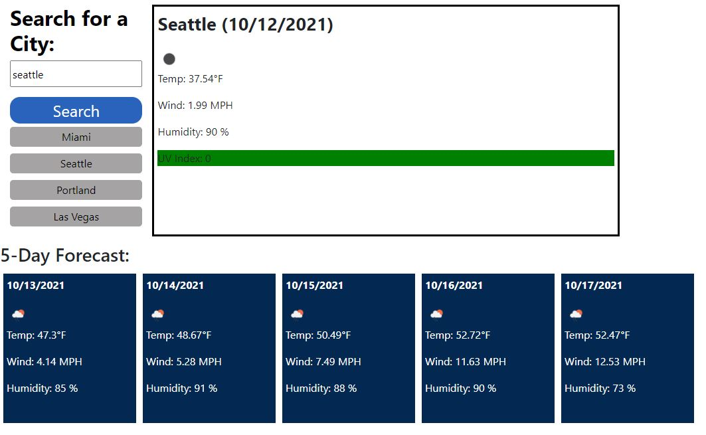

# Weather-Dashboard

Link: https://cj8355.github.io/Weather-Dashboard/

## Description
Search for a city's weather to see the current weather conditions and a 5 day forecast.

## Table of Contents

- [Installation](#installation)
- [Usage](#usage)
- [Credits](#contributing)
- [License](#license)
- [Tests](#tests)
- [Questions](#git)

## Installation
The following necessary dependencies must be installed to run the
application properly: N/A

## Usage
Search for a city in the search box.

## Credits
N/A

## License
This project is licensed under the The MIT License.

## Tests
The following is needed to run the test: N/A

## Questions
If you have any questions about the repo, open an issue or contact cj8355
directly at: charlescallender.cc@gmail.com